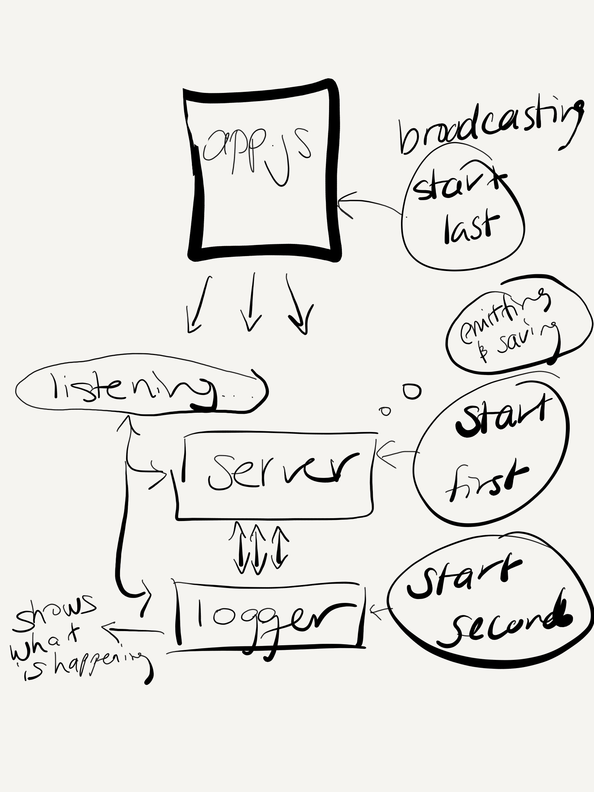

# LAB - 18 Socket.io

### Author: Adriana with help from Jonny

### Links and Resources
* [submission PR](https://github.com/adrianagraybill/lab-18/pull/1)

#### Documentation
* [api docs](No docs since it's not an express server)

### Setup

#### `.env` requirements
* .env file required
* `PORT 3001`

#### Running the app
* node server.js
* node logger.js
* node app.js ./files/test.txt

#### UML

